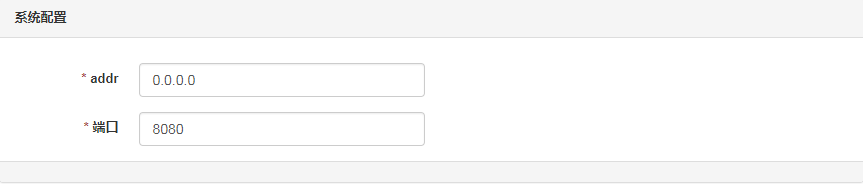
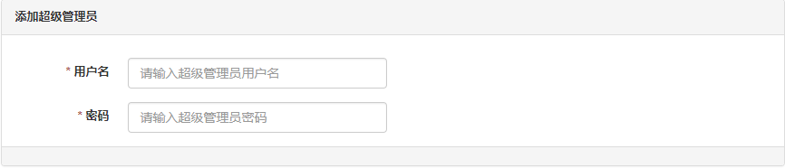

# 后台安装

> bzppx-codepub 后台系统安装

## 准备好安装目录
```
# 创建目录, 名字可以随意起
$ mkdir codepub
$ cd codepub
```

## 下载最新发布的版本

> 请参照你自己的平台下载对应的安装包
地址: https://github.com/bzppx/bzppx-codepub/releases

以 linux amd64 为例，下载 v0.8.1 版本（注意，请下载最新版本）
```
> wget https://github.com/bzppx/bzppx-codepub/releases/download/v0.8.1/bzppx-codepub-linux-amd64.tar.gz

# 解压到当前目录
> tar -zxvf bzppx-codepub-linux-amd64.tar.gz
```

## 安装系统配置

### 自助安装系统配置

进入安装目录 install (注意，这里必须进入安装目录 install )
```
> cd install
```

执行安装程序，port 默认为 8090
```
> ./install --port=8090
```

打开浏览器，输入 http://你安装的机器ip:8090, 如果是本机访问，http://127.0.0.1:8090  

- 系统配置
    
    addr 为系统监听的 ip, 0.0.0.0 表示监听所有的 ip.

- 数据库配置
    
   依次配置数据库的host, 端口，用户名，密码，数据库名，限制连接数，最大连接数
   
- 添加系统管理员
    
    系统超级管理员是系统安装完后最大权限用户，安装完成后首次登录需要用超级管理员登录

安装完成后，conf 目录会自动生成配置文件 codepub.conf  
Ctrl + C 停止 install 程序  
自助安装配置完成  

### 手动安装系统配置

#### 配置文件

复制一份默认的配置文件, 复制到任意目录打开配置文件修改配置
```
> cp conf/default.conf conf/codepub.conf
> vim codepub.conf 
```

配置文件配置说明
```
httpaddr = "127.0.0.1" # 系统监听的 ip
httpport = 8080 # 系统监听的端口

[db]
host="127.0.0.1" # 数据库账号
port="3306" # 数据库端口
name="codepub" # 数据库名
user="root" # 数据库库账号
pass="admin" # 数据库密码
table_prefix="cp_" # 表前缀，不用改即可
conn_max_idle=30 # 最大的闲置的连接数
conn_max_connection=200 # 最大连接数

[log]
console="{"level":7, "color":true}"
file="{"level":7, "filename":"logs/codepub.log"}" # 日志配置
```

#### mysql 创建数据库

1. 创建的数据库名必须和上面配置文件配置的 name 相同
2. 创建表，表结构文件，docs/databases/table.sql
3. 在 cp_user 表里添加超级管理员，切记 role 字段必须为 3，请务必记住 username 和 password

## 启动系统

需指定配置文件
```
./bzppx-codepub --conf conf/codepub.conf
```

可设置后台启动

## 访问

加入你监听的是本地的 ip 127.0.0.1, 端口是 80  

浏览器输入：http://127.0.0.1  会出现登录界面  

输入刚才配置的超级管理员的账号和密码，登录成功！